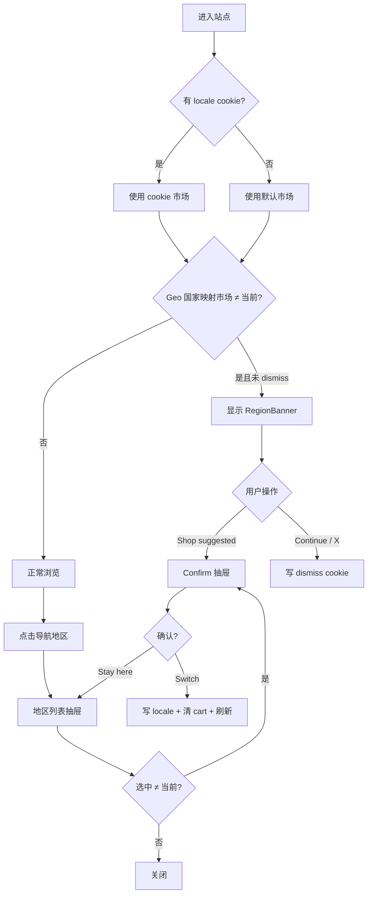

# 地区 / 市场切换功能设计文档

> 状态：已确认，可进入实现  
> 范围：顶部 Geo 提示条、导航地区选择、切换确认抽屉  
> 参考设计：地区列表抽屉、Switch field location 确认态、顶部黑色提示条  
> 关闭图标：`app/assets/close_circle_fill.png`  
> Shopify Markets：已配置完成（UK / Europe×17 / US / HK / SG / JP / KR / AU / CA / TW / Rest of the World）  
> 选择器数据源：代码 `app/data/regions.ts`（不用 Metaobject）

---

## 1. 目标

在 Hydrogen 店面实现与 Shopify Markets 联动的地区体验：

1. **Geo 提示条**：根据用户 IP 近似地区，判断当前浏览的市场是否匹配；不匹配时在页顶展示黑色提示条，引导切换或继续浏览。
2. **地区选择**：导航栏展示当前地区 / 货币（如 `UK / GBP £`），点击打开右侧抽屉，列表来自 Shopify 配置，不在代码中写死地区。
3. **切换确认**：选择目标地区后进入 confirm 态（设计图 “Switch field location?”），文案随目标地区动态变化；确认后切换市场并清空当前购物车。

不自动强制跳转（符合 Shopify 对 locale detection 的建议：只提示，不静默重定向）。

---

## 2. 现状与差距

| 能力 | 现状 | 目标 |
|------|------|------|
| i18n 上下文 | `context.ts` 硬编码 `{ language: 'EN', country: 'US' }` | 从 cookie / 用户选择解析 |
| 地区列表 | `PageLayout.tsx` 中 `LOCALE_OPTIONS` 硬编码 | 从 Shopify 配置读取 |
| 导航文案 | Header 写死 `UK / GBP £` | 显示当前市场简称 + 货币 |
| 切换逻辑 | 点击仅 `close()` | 进入 confirm → 写 cookie → 清 cart → 刷新上下文 |
| Geo 提示 | 无 | IP 检测 + 顶部 banner |
| URL 结构 | 无 locale 前缀 | **已确认：Cookie 方案，URL 保持不变**（见 §4） |

已有可复用骨架：`Aside` 的 `locale` 抽屉、`brand` chrome、Header 触发按钮、`cart` 的 `BuyerIdentityUpdate` action。

---

## 3. Shopify 侧配置（数据源）

### 3.1 Markets（必做）

在 Shopify Admin → **Settings → Markets** 配置各地区市场，例如设计图中的：

| 展示名（示例） | 代表 CountryCode（`@inContext`） | 货币 |
|----------------|----------------------------------|------|
| United Kingdom | `GB` | GBP |
| Europe | 市场内代表国，如 `DE` / `FR` | EUR |
| United States | `US` | USD |
| Hong Kong SAR | `HK` | HKD |
| Singapore | `SG` | SGD |
| Japan | `JP` | JPY |
| South Korea | `KR` | KRW |
| Australia | `AU` | AUD |
| Canada | `CA` | CAD |
| Taiwan Region | `TW` | TWD |
| Rest of the World | 国际市场代表国，如 `GB` 或店铺默认 | GBP |

说明：

- Storefront API 的 `@inContext(country:)` 需要 **国家码**，不能传 “Europe” 这种市场名。
- 多国市场（Europe / Rest of the World）在切换时使用该市场的 **代表国家码**，以拿到正确货币与目录。

### 3.2 地区选择器配置（已确认：代码配置）

Storefront API 的 `localization.availableCountries` 返回的是 **国家列表**，不是设计图里的 **市场级条目**（Europe、Rest of the World 等）。因此选择器 UI 需要一层市场级配置。

**已确认方案：仓库内代码配置**（如 `app/data/regions.ts`），不使用 Metaobject。

| 字段 | 用途 |
|------|------|
| `id` | 稳定标识，如 `gb`、`eu`、`row` |
| `label` | 列表文案，如 `United Kingdom`、`Rest of the World` |
| `confirmLabel` | Confirm 正文目标店名，如 `International`（可与 `label` 不同） |
| `shortLabel` | 导航简称 + Confirm 按钮前缀，如 `UK`、`EU`、`International` |
| `countryCode` | Storefront `@inContext` 用，如 `GB` |
| `currencyCode` | 展示用，如 `GBP` |
| `currencySymbol` | 如 `£` |
| `countries` | Geo 映射覆盖的国家码列表（单国市场可省略，默认 `[countryCode]`） |
| `isDefault` | 默认市场（UK 为 `true`） |

**分工：**

- **Shopify Markets**：真实售卖范围、货币、目录（已在 Admin 配好）
- **`regions.ts`**：选择器文案、confirm 文案、代表国家码、Geo 映射

运行时可用 Storefront `localization.availableCountries` 校验 `countryCode` 是否在 Markets 启用范围内；配置错误时直接暴露，不做静默兜底。

增删市场或改文案需改代码并发版。

### 3.3 不采用的方案

- **Metaobject**：适合运营频繁改文案；本期市场稳定，用代码更简单。
- **仅 `availableCountries`**：UI 变成国家列表，与设计不符。
---

## 4. 本地化策略（本期决策）

### 4.1 已确认：Cookie 持久化当前市场（URL 不变）

**产品决策（2026-07-10）：采用 Cookie 模式，URL 尽量保持一致**（无 `/en-gb` 等 path 前缀，无按市场拆分的 subdomain）。

| 项 | 说明 |
|----|------|
| Cookie 名 | 建议 `tenth_locale`（或写入现有 Hydrogen session） |
| 值 | 如 `EN-GB` / `{ language, country }` |
| 优先级 | 用户已选 cookie ≫ **默认 UK（GB + EN）** |
| Geo | **只用于提示条**，不自动改写 cookie |
| URL | 切换市场前后路径相同，例如始终为 `/products/...` |
| Cookie Consent | locale / dismiss **可直接写**；不改动现有 consent 弹窗 |

`createHydrogenContext` 中：

```ts
i18n: getLocaleFromRequest(request) // 读 cookie → { language, country }
```

所有已带 `@inContext` 的 Storefront 查询会随 `storefront.i18n` 自动注入正确国家 / 语言。

### 4.2 不采用：URL path 前缀（`/en-gb/...`）

已明确不做 path-based，避免 URL 随市场变化。SEO 上 cookie 方案对爬虫不友好（爬虫常无 cookie），接受该取舍；若日后要做 SEO 再单独立项。

### 4.3 Shopify 官方约束（必须遵守）

- Geo / header / cookie 检测：**只用于改善体验（提示条）**，禁止自动重定向。
- SEO bot 常来自 US 且无 cookie；cookie 方案对 SEO 不友好，故默认市场需明确，且后续可补 path-based。

参考：

- [Internationalization with Shopify Markets](https://shopify.dev/docs/storefronts/headless/hydrogen/markets)
- [Localization detection](https://shopify.dev/docs/storefronts/headless/hydrogen/markets/locale-detection)
- [Markets cookbook](https://shopify.dev/docs/storefronts/headless/hydrogen/cookbook/markets)
- [localization query](https://shopify.dev/docs/api/storefront/latest/queries/localization)

---

## 5. 功能设计

### 5.1 顶部 Geo 提示条（设计图黑色条）

**出现条件（全部满足）：**

1. 能从请求得到近似国家码（Oxygen / Cloudflare：`request.cf?.country`，或部署环境等价 header）。
2. 将该国家码映射到 `regions.ts` 中某市场的 `countries` / `countryCode`（见 §5.1.1）。
3. 映射到的市场 ≠ 当前 cookie / i18n 市场。
4. 用户未 dismiss（见下方 cookie）。

**文案结构（动态）：**

> You're currently viewing our {currentMarketLabel} store, would you prefer to shop on our {suggestedMarketLabel} site?

**操作：**

| 控件 | 行为 |
|------|------|
| `Shop {short} Store`（白底 pill） | 进入与手动选择相同的 **confirm 流程**（目标 = 建议市场） |
| `Continue Shopping`（描边 pill + X） | 关闭提示条，写 **会话级** dismiss cookie；与圆形关闭同一行为 |
| 最右侧圆形关闭 | 使用 `app/assets/close_circle_fill.png`；行为同 Continue Shopping |

本地开发：`request.cf` 可能为空，可用环境变量 / 请求头 mock（如 `X-Debug-Country: GB`）便于联调；**不**做生产兜底假数据。

#### 5.1.1 国家 → 市场映射

Geo 得到的是 ISO 国家码（如 `FR`），选择器展示的是市场（如 Europe）。

**已确认：**

- 从 `regions.ts` 各市场的 `countries` 做 Geo → 市场映射。
- Europe 的 `countries` 使用以下 17 国（与 Admin Markets「Europe · 17 regions」对齐）：

| 国家 | Code |
|------|------|
| Germany | `DE` |
| France | `FR` |
| Italy | `IT` |
| Spain | `ES` |
| Netherlands | `NL` |
| Belgium | `BE` |
| Austria | `AT` |
| Portugal | `PT` |
| Sweden | `SE` |
| Denmark | `DK` |
| Finland | `FI` |
| Ireland | `IE` |
| Poland | `PL` |
| Czech Republic | `CZ` |
| Romania | `RO` |
| Hungary | `HU` |
| Greece | `GR` |

未命中任何市场时：**不展示**提示条（不猜测）。

### 5.2 导航栏地区入口

- 文案：`{short_label} / {currency_code} {currency_symbol}`，例如 `UK / GBP £`。
- 点击：`open('locale')`，打开地区列表抽屉（已有交互）。
- `active` 态：抽屉打开时保持现有样式。

数据来自 root loader 下发的 `currentRegion` + `regions[]`。

### 5.3 地区列表抽屉（Selection）

- 复用现有 `Aside type="locale"` + `chrome="brand"`。
- 列表项格式：`{label} [ {currency_code} {currency_symbol} ]`。
- 点击某项：
  - 若与当前市场相同 → 直接关闭。
  - 若不同 → 切换到 **confirm 态**（同一抽屉内换内容，或新 `Aside` type `locale-confirm`）。

推荐：**同一 `locale` Aside 内用本地 state 切换 selection / confirm**，避免多一层 overlay 类型；关闭时重置为 selection。

### 5.4 确认态（Confirm / Switch field location）

选择目标地区后进入 confirm。文案随目标地区变化（见设计截图 11 种变体）。

#### 5.4.1 文案模板

| 元素 | 规则 | 是否随地区变化 |
|------|------|----------------|
| 标题 | `Switch field location?` | 否（固定） |
| 正文 | `You're moving to the {confirm_label} store. Your current cart is linked to your present location and will be cleared when you switch.` | 是：`{confirm_label}` |
| Primary 按钮 | `Switch to {short_label}/English` | 是：`{short_label}`；`/English` 固定 |
| Secondary | `Stay here` | 否（固定） |

#### 5.4.2 各地区文案对照表（设计稿）

| 列表 `label` | 正文 `{confirm_label}` | 按钮 `{short_label}` | 完整 Primary 按钮 |
|--------------|------------------------|----------------------|-------------------|
| United Kingdom | United Kingdom | UK | `Switch to UK/English` |
| Europe | Europe | EU | `Switch to EU/English` |
| United States | United States | US | `Switch to US/English` |
| Hong Kong SAR | Hong Kong SAR | HK | `Switch to HK/English` |
| Singapore | Singapore | SG | `Switch to SG/English` |
| Japan | Japan | JP | `Switch to JP/English` |
| South Korea | South Korea | KR | `Switch to KR/English` |
| Australia | Australia | AU | `Switch to AU/English` |
| Canada | Canada | CA | `Switch to CA/English` |
| Taiwan Region | Taiwan Region | TW | `Switch to TW/English` |
| Rest of the World | **International** | **International** | `Switch to International/English` |

注意：

- 多数市场：`label` === `confirm_label`，`short_label` 为两字母简称。
- **Rest of the World 特例**：列表仍显示 `Rest of the World [ GBP £ ]`；confirm 正文与按钮使用 `International`，不是 `Rest of the World` / `ROW`。
- 实现时从 `regions.ts` 读 `confirmLabel`、`shortLabel`，**不要**用 `label` 硬推按钮文案（否则 ROW 会对不上设计）。

#### 5.4.3 操作行为

| 控件 | 行为 |
|------|------|
| Primary：`Switch to {short_label}/English` | 提交切换 action |
| Secondary：`Stay here` | 回到列表态或关闭抽屉 |

### 5.5 切换执行流程

```
用户确认
  → POST /locale (或现有 cart action 扩展)
  → 写入 locale cookie
  → 清空购物车（删除 cart id / create 空 cart；与设计文案一致）
  → 可选：cart.updateBuyerIdentity({ countryCode })（新 cart 时在 create 时带上）
  → redirect 回当前 URL（或 reload）
  → context 用新 i18n；价格 / 货币随 @inContext 更新
```

**购物车策略（与设计一致）：跨市场切换一律清空 cart。**  
不做「尝试保留 line items」的兼容分支；若后续 Shopify 支持同货币跨市场保留，再单独立项。

### 5.6 Dismiss / 偏好 Cookie

| Cookie | 用途 |
|--------|------|
| `tenth_locale` | 用户当前市场 |
| `tenth_geo_banner_dismissed` | 关闭提示条后不再展示（直到过期或手动清 cookie） |

与 Cookie Consent 的关系：若站点将「偏好」类 cookie 纳入同意范围，需在实现前确认是否仅在同意后写入；**待产品确认**。

---

## 6. 信息架构与组件

```
PageLayout
├── RegionBanner          // 新增：顶部黑色条（条件渲染）
├── Header
│   └── LocaleTrigger     // 动态文案，open('locale')
├── Aside locale
│   ├── RegionList        // selection
│   └── RegionConfirm     // confirm（同抽屉内）
├── main / Footer ...
```

### 6.1 数据流

```
Request
  → getLocaleFromRequest (cookie)
  → createHydrogenContext({ i18n })
  → root loader:
       - localization query（当前 country/currency 校验）
       - regions from `app/data/regions.ts`
       - geoCountry from cf
       - suggestedRegion / showBanner
  → PageLayout / Header / Banner / LocaleAside
```

### 6.2 主要改动文件（实现阶段）

| 文件 | 改动 |
|------|------|
| `app/data/regions.ts`（新） | 11 个市场的选择器 / confirm / Geo 配置 |
| `app/lib/context.ts` | `getLocaleFromRequest` |
| `app/lib/locale.ts`（新） | cookie 读写、国家→市场映射、文案 helper |
| `app/lib/fragments.ts` | `LOCALIZATION_QUERY` |
| `app/root.tsx` | 下发 regions / current / banner；必要时调整 `shouldRevalidate` |
| `app/routes/locale.tsx`（新） | POST action：设 cookie、清 cart、redirect |
| `app/components/RegionBanner.tsx`（新） | 顶部提示条 |
| `app/components/PageLayout.tsx` | 去掉硬编码列表；接 selection/confirm |
| `app/components/Header.tsx` | 动态地区文案 |
| `app/components/Aside.tsx` | 如需扩展 type / confirm 布局 |
| `app/styles/app.css` | banner + confirm 样式 |
| Shopify Admin | Markets（已完成） |

---

## 7. GraphQL（草案）

### 7.1 Localization

```graphql
query Localization(
  $country: CountryCode
  $language: LanguageCode
) @inContext(country: $country, language: $language) {
  localization {
    country {
      isoCode
      name
      currency {
        isoCode
        symbol
      }
    }
    language {
      isoCode
      name
    }
    availableCountries {
      isoCode
      name
      currency {
        isoCode
        symbol
      }
    }
  }
}
```

### 7.2 地区配置（代码，非 GraphQL）

地区列表不走 GraphQL，直接从 `app/data/regions.ts` import。示例结构：

```ts
export const REGIONS = [
  {
    id: 'gb',
    label: 'United Kingdom',
    confirmLabel: 'United Kingdom',
    shortLabel: 'UK',
    countryCode: 'GB',
    currencyCode: 'GBP',
    currencySymbol: '£',
    isDefault: true,
  },
  {
    id: 'eu',
    label: 'Europe',
    confirmLabel: 'Europe',
    shortLabel: 'EU',
    countryCode: 'DE', // 代表国，用于 @inContext
    currencyCode: 'EUR',
    currencySymbol: '€',
    countries: ['DE', 'FR', 'IT', /* ... */],
  },
  {
    id: 'row',
    label: 'Rest of the World',
    confirmLabel: 'International',
    shortLabel: 'International',
    countryCode: 'GB', // 或 ROW 市场代表国
    currencyCode: 'GBP',
    currencySymbol: '£',
  },
  // ...
] as const;
```
---

## 8. UI 规格（对齐设计图）

### 8.1 RegionBanner

- 全宽、黑底、白字、小字号 sans。
- 左文案、右操作组；桌面一行，窄屏可折行（实现时按现有断点处理）。
- Primary：白底黑字 pill + 可选 globe icon。
- Secondary：黑底白描边 pill。
- 关闭：圆形描边 X。

### 8.2 Locale 列表

- 沿用现有 brand drawer / `drawer-list` 细线分隔。
- 无本地硬编码文案列表。

### 8.3 Confirm

- 白底抽屉内容区（设计图为白面板；可与 brand 点阵背景区分，confirm 用 default chrome 或内层白卡片）。
- 标题偏展示字体（若项目已有 serif / display token 则复用，否则用现有 heading）。
- Primary：深灰矩形按钮；Secondary：文字链 `Stay here`。

---

## 9. 边界与错误处理

| 场景 | 行为 |
|------|------|
| `regions.ts` 为空或无效 | 地区入口展示明确错误；不静默编造列表 |
| `country_code` 不在 `availableCountries` | 开发/日志暴露配置错误；该条目不渲染或整表报错（实现时选一种，不做静默替换） |
| 无 geo 信息 | 不显示 banner |
| 切换 action 失败 | 表面错误，不假装已切换 |
| 用户已在建议市场 | 不显示 banner |

符合项目约定：**不做隐藏式 fallback**。

---

## 10. 测试计划（实现后）

- [ ] `regions.ts` 与设计图 11 区一致；抽屉列表顺序与文案正确。
- [ ] 导航文案随当前市场变化。
- [ ] 选择其他市场 → confirm 文案含目标市场名 → 确认后货币 / 价格变化、cart 清空。
- [ ] Stay here / 关闭不改变市场。
- [ ] Mock `X-Debug-Country` 与当前市场不一致时出现 banner；文案正确。
- [ ] Shop suggested store → 进入同一 confirm 流程。
- [ ] Continue Shopping / X → banner 消失且刷新后仍隐藏（在 dismiss 有效期内）。
- [ ] 无 geo / 已匹配市场 → 无 banner。
- [ ] 本地 `http://localhost:3080` 联调通过。

---

## 11. 已确认决策

| # | 事项 | 决策 |
|---|------|------|
| 1 | 选择器数据源 | **代码 `app/data/regions.ts`**；Markets 负责售卖/货币 |
| 2 | 路由 | **Cookie**；URL 不变（无 path-based） |
| 3 | 购物车 | 跨市场切换 **一律清空** |
| 4 | Banner dismiss | **会话级**；Continue Shopping 与圆形关闭 **同一行为**；关闭图标用 `close_circle_fill.png` |
| 5 | Geo → 市场映射 | `regions.ts` 的 `countries`；Europe 用 §5.1.1 的 17 国 |
| 6 | 语言 | 本期 **仅 English**；confirm 按钮形如 `Switch to {shortLabel}/English`；正文用 `{confirmLabel}`（见 §5.4） |
| 7 | 默认市场 | 无 cookie 时默认 **UK（GB）** |
| 8 | Cookie Consent | **locale / dismiss 可直接写入**；**不得影响**现有 Cookie Consent 弹窗逻辑 |

---

## 12. 建议实现顺序

1. ~~Shopify Admin Markets（已完成）~~ + 新增 `app/data/regions.ts`  
2. `getLocaleFromRequest` + context i18n（默认 UK）  
3. root 拉取 localization + 下发 current region / banner  
4. Header 动态文案 + 列表抽屉接 `regions.ts`  
5. Confirm 态 + `/locale` action（清 cart）  
6. RegionBanner + geo 映射 + 会话级 dismiss（关闭图标）  
7. 样式对齐设计图 + 本地联调  
8. 确认 Cookie Consent 弹窗行为未被改动  

---

## 附录：用户流程


